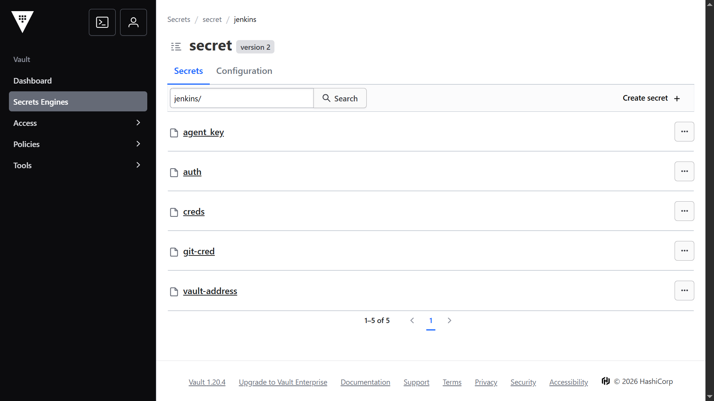
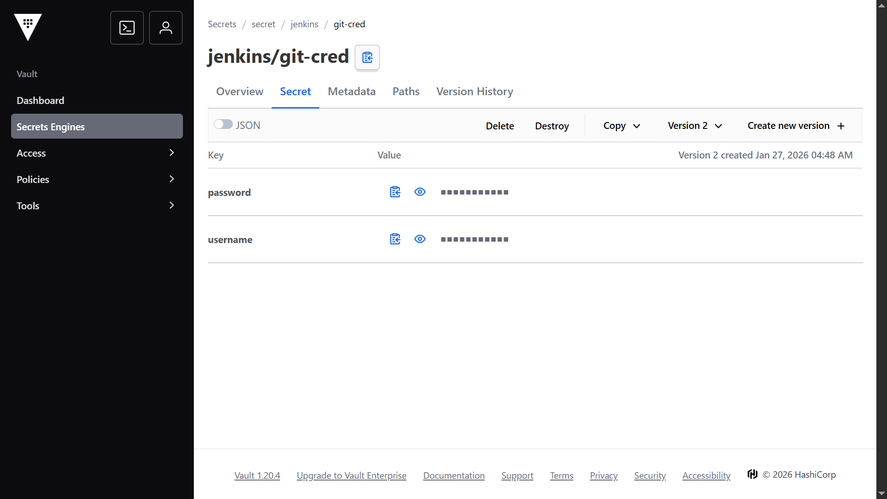
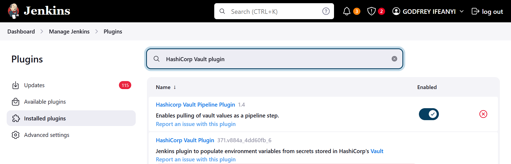
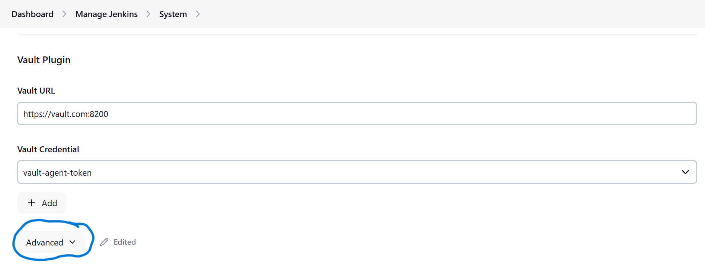
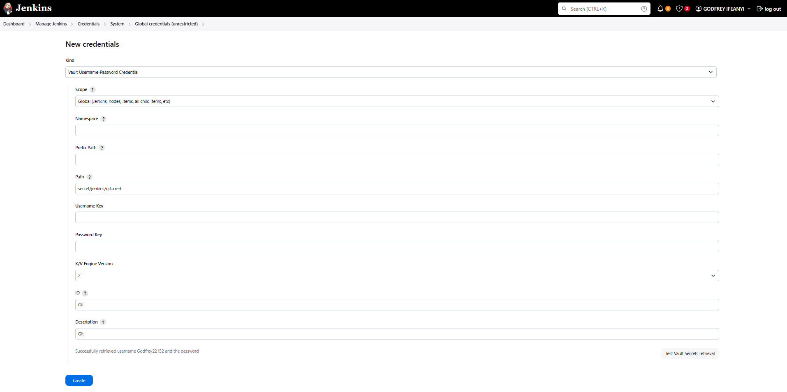

# Jenkins Agents Integration with HashiCorp Vault

This document provides a comprehensive guide for setting up HashiCorp Vault for secret management and integrating it with Jenkins agents. It covers Vault installation and initialization on a production server, Vault configuration for Jenkins, setup on the Jenkins host, and management of the Vault Agent as a systemd service.

---

## 1. Prerequisites

Before proceeding, ensure you have the following:

* An **Ubuntu-based server** for hosting Vault (production-ready, with sufficient resources for high availability if needed).
* A **Kubernetes cluster** (kubeadm-based) for Jenkins agents if using Kubernetes plugin.
* **Jenkins master (controller)** installed and operational.
* **Jenkins agents** configured (via SSH, Docker, or Kubernetes plugin).
* Administrative access (root or sudo) on all relevant hosts.
* Basic knowledge of Vault concepts, such as AppRoles, policies, and transit engines.
* A valid DNS record for the Vault server hostname (required for TLS certificate verification).
* Replace placeholders like `<hostname>`, `<loopbackIP>`, and `<host>` with your actual values throughout the guide.

**Note:** This guide assumes a single-node Vault setup for simplicity. For production, refer to HashiCorp's [production hardening guide](https://learn.hashicorp.com/tutorials/vault/production-hardening) for high availability (HA), Raft storage, and additional security measures.

---

## 2. Install and Initialize Vault Server in a Production-like manner 

Install Vault on your Ubuntu-based production server and configure it for secure operation. This includes adding the HashiCorp repository, installing the package, generating TLS certificates, configuring the server, and initializing Vault.

### A. Install Vault Server in Prod Mode

Visit the **[Vault official installation link](https://developer.hashicorp.com/vault/install#linux)**
Run the following commands to add the HashiCorp repository and install Vault:

```bash
wget -O- https://apt.releases.hashicorp.com/gpg | sudo gpg --dearmor -o /usr/share/keyrings/hashicorp-archive-keyring.gpg
echo "deb [arch=$(dpkg --print-architecture) signed-by=/usr/share/keyrings/hashicorp-archive-keyring.gpg] https://apt.releases.hashicorp.com $(grep -oP '(?<=UBUNTU_CODENAME=).*' /etc/os-release || lsb_release -cs) main" | sudo tee /etc/apt/sources.list.d/hashicorp.list
sudo apt update && sudo apt install vault
```

Verify the installation:

```bash
vault -v
```

This installs Vault and creates a system user/group (`vault`) along with a default configuration file at **`/etc/vault/vault.hcl`**.

### B. Generate TLS Certificates

For production, use self-signed or CA-signed certificates. Here's how to generate a self-signed certificate:

```bash
sudo mkdir -p /opt/vault/{tls,data}
sudo chown -R vault:vault /opt/vault
cd /opt/vault/tls
openssl req -out tls.crt -new -keyout tls.key -newkey rsa:4096 -nodes -sha256 -x509 -subj "/O=HashiCorp/CN=Vault" -addext "subjectAltName = IP:<loopbackIP>,DNS:<host>" -days 3650
```

- Replace `<loopbackIP>` with `0.0.0.0` (or your server's loopback IP).
- Replace `<host>` with your Vault server's hostname (e.g., `vault.com`).

Set permissions:

```bash
sudo chown vault:vault /opt/vault/tls/*
sudo chmod 600 /opt/vault/tls/*
```

### C. Configure Vault Server

Edit or create the Vault configuration file at `/etc/vault/vault.hcl` with the following content (adjust as needed for your environment):

```hcl
# Full configuration options: https://www.vaultproject.io/docs/configuration

ui = true

storage "file" {
  path = "/opt/vault/data"
}

# HTTPS listener
listener "tcp" {
  address       = "0.0.0.0:8200"
  tls_cert_file = "/opt/vault/tls/tls.crt"
  tls_key_file  = "/opt/vault/tls/tls.key"
}
```

This enables the Vault UI, uses file-based storage (replace with Raft for HA), and configures TLS listening on all interfaces.

### D. Start Vault Service

Start and enable the Vault systemd service:

```bash
sudo systemctl start vault
sudo systemctl enable vault
sudo systemctl status vault
```

### E. Initialize Vault

Set environment variables for interacting with Vault:

```bash
export VAULT_ADDR='https://<hostname>:8200'
export VAULT_CACERT="/opt/vault/tls/tls.crt"
```

- Replace `<hostname>` with your Vault server's hostname (e.g., `vault.example.com`).

Initialize Vault to generate unseal keys and the root token:

```bash
vault operator init
```

- This outputs 5 unseal keys (by default) and a root token. Securely store these (e.g., in a password manager). You need at least 3 keys to unseal Vault.
- Alternatively, use the Vault UI at `https://<hostname>:8200` and enter 5 for key shares and 3 for the threshold.

### F. Unseal and Login to Vault

Unseal Vault by providing the required number of keys (repeat for each key):

```bash
vault operator unseal --ca-cert=/opt/vault/tls/tls.crt
```

Check Vault status:

```bash
vault status
```

Login with the root token:

```bash
vault login
```

Vault is now initialized and ready for configuration. For enhanced security, revoke the root token after setup and use admin policies instead.

**Note:** Ensure your DNS record for `<hostname>` is configured correctly, as TLS verification will fail otherwise. Refer to the [production hardening tutorial](https://learn.hashicorp.com/tutorials/vault/production-hardening) for additional steps like enabling audit logs, using Raft storage, and implementing mlock.

---

## 3. Setup Overview

1. Create a Vault AppRole for Jenkins with short TTLs and limited access.
2. Store the AppRole credentials (`RoleID`, `SecretID`) securely on the Jenkins host.
3. Configure and run `vault agent` as a systemd service on the Jenkins host.
4. Use the Vault Agent to auto-authenticate and render an environment file containing a short-lived token.
5. Configure Jenkins to use that environment file for Vault authentication.

### Security Guidelines

* Keep `role_id` and `secret_id` readable only by **vault** or **root**.
* Set strict permissions for Vault token sink and environment files.
* Use short TTLs and single-use `secret_id` if automation is available.
* Test all configurations in a staging environment before production.

---

## 4. Configure Vault for Jenkins

With Vault running, configure it specifically for Jenkins integration. Run these commands on the Vault server or an authenticated admin machine using the root token or an admin policy.

### A. Enable and Configure AppRole

Enable the AppRole authentication method:

```bash
vault auth enable approle
```

### B. Enable Transit Engine

The Transit engine is used for cryptographic operations, such as signing and verification with **[cosign](https://docs.sigstore.dev/cosign/signing/signing_with_containers/)**. The URI format for Hashicorp Vault KMS is: `hashivault://$keyname`. It requires standard Vault environment variables (`VAULT_ADDR`, `VAULT_TOKEN`) is set correctly.

#### 1. Enable the Transit Engine

```bash
vault secrets enable transit
```

Verify if it's already enabled:

```bash
vault secrets list
```

#### 2. Create a Signing Key

Create a key named `cosign`:

```bash
vault write -f transit/keys/cosign type=ecdsa-p256
```

#### 3. List and View Keys

```bash
# List all transit keys
vault list transit/keys

# Read the cosign key details
vault read transit/keys/cosign
```

You now have the key name: **cosign**.

### C. Create a Jenkins Policy

This policy grants access to KV secrets and the Transit engine for Cosign operations.

```bash
cat > jenkins-policy.hcl <<'EOF'
## KV secrets access
path "secret/data/jenkins/*" {
  capabilities = ["read"]
}

## Cosign Transit Engine Access
# Allow reading the transit key metadata and public key
path "transit/keys/cosign" {
  capabilities = ["read", "list"]
}

# Allow signing operations
path "transit/sign/cosign" {
  capabilities = ["create", "update"]
}

path "transit/sign/cosign/*" {
  capabilities = ["create", "update"]
}

# Allow verification operations
path "transit/verify/cosign" {
  capabilities = ["create", "update"]
}

path "transit/verify/cosign/*" {
  capabilities = ["create", "update"]
}

# Allow HMAC operations (optional)
path "transit/hmac/cosign" {
  capabilities = ["create", "update"]
}

path "transit/hmac/cosign/*" {
  capabilities = ["create", "update"]
}

# CRITICAL: Allow export of public key (required for cosign)
path "transit/export/signing-key/cosign" {
  capabilities = ["read"]
}

# Allow reading transit mount info
path "transit/" {
  capabilities = ["read", "list"]
}
EOF

vault policy write jenkins-policy jenkins-policy.hcl
```

### D. Create the Jenkins AppRole

Attach the policy to the AppRole:

```bash
vault write auth/approle/role/jenkins-role \
  token_ttl=5h \
  token_max_ttl=24h \
  secret_id_ttl=2h \
  secret_id_num_uses=150 \
  token_num_uses=100 \
  token_type=service \
  policies=jenkins-policy
```

### E. Retrieve AppRole Credentials

```bash
vault read -field=role_id auth/approle/role/jenkins-role/role-id > role_id.txt
vault write -f -format=json auth/approle/role/jenkins-role/secret-id | jq -r '.data.secret_id' > secret_id.txt
```

Secure these files (`role_id.txt` and `secret_id.txt`) and transfer them to the Jenkins host.

---

## 5. Vault Agent Setup on the Jenkins Server

On the Jenkins host, install the Vault binary (which includes the agent) and set up secure storage for credentials.

### A. Install Vault Agent

```bash
wget -O- https://apt.releases.hashicorp.com/gpg | sudo gpg --dearmor -o /usr/share/keyrings/hashicorp-archive-keyring.gpg
echo "deb [arch=$(dpkg --print-architecture) signed-by=/usr/share/keyrings/hashicorp-archive-keyring.gpg] https://apt.releases.hashicorp.com $(grep -oP '(?<=UBUNTU_CODENAME=).*' /etc/os-release || lsb_release -cs) main" | sudo tee /etc/apt/sources.list.d/hashicorp.list
sudo apt update && sudo apt install vault -y
vault -v
```

### B. Create Vault Agent Directory and Secure Files

```bash
sudo mkdir -p /var/lib/vault-agent/
sudo chown -R vault:vault /var/lib/vault-agent/
sudo chmod 750 /var/lib/vault-agent

sudo cp /path/to/role_id.txt /var/lib/vault-agent/role_id
sudo cp /path/to/secret_id.txt /var/lib/vault-agent/secret_id

sudo chown vault:vault /var/lib/vault-agent/role_id /var/lib/vault-agent/secret_id
sudo chmod 600 /var/lib/vault-agent/role_id /var/lib/vault-agent/secret_id
```

Replace `/path/to/` with the actual location of the credential files.

---

## 6. Vault Agent Configuration

Configure the Vault Agent to authenticate using AppRole and generate a token environment file for Jenkins.

### A. Create Agent Configuration File

Create `/etc/vault/agent.hcl`:

```hcl
pid_file = "/run/vault/vault-agent.pid"
listener "tcp" {
  address = "127.0.0.1:8250"
  tls_disable = true
}

auto_auth {
  method "approle" {
    mount_path = "auth/approle"
    config = {
      role_id_file_path = "/var/lib/vault-agent/role_id"
      secret_id_file_path = "/var/lib/vault-agent/secret_id"
      remove_secret_id_file_after_reading = false
    }
  }

  sink "file" {
    config = {
      path = "/var/lib/vault-agent/.vault-token"
      mode = 0644
    }
  }
}

template {
  source      = "/var/lib/vault-agent/templates/token_env.tpl"
  destination = "/var/lib/jenkins/vault/token"
  perms       = "0640"
  command     = "systemctl try-restart jenkins.service"
}

vault {
  address = "https://172.26.44.182:8200"
  tls_skip_verify = true
}
```

Update the `vault.address` to match your Vault server's address.

### B. Create Template File

```bash
sudo tee /var/lib/vault-agent/templates/token_env.tpl > /dev/null <<'EOF'
VAULT_TOKEN={{ with secret "auth/token/lookup-self" }}{{ .Data.id }}{{ end }}
EOF
```

### C. Set Permissions

```bash
sudo chown vault:vault /etc/vault/agent.hcl
sudo chmod 640 /etc/vault/agent.hcl

sudo chown -R vault:vault /var/lib/vault-agent
sudo chmod 750 /var/lib/vault-agent
sudo chmod 750 /var/lib/vault-agent/templates
sudo chmod 640 /var/lib/vault-agent/templates/token_env.tpl

sudo mkdir -p /var/lib/jenkins/vault
sudo chown -R vault:jenkins /var/lib/jenkins/vault
sudo chmod 770 /var/lib/jenkins/vault
```

---

## 7. Configure Vault Agent as a Systemd Service

Run the Vault Agent as a background service for automatic token renewal.

### A. Create Unit File

Create `/etc/systemd/system/vault-agent.service`:

```bash
sudo tee /etc/systemd/system/vault-agent.service > /dev/null <<'EOF'
[Unit]
Description=Vault Agent (auto-auth for Jenkins)
After=network.target

[Service]
Type=simple
ExecStart=/usr/bin/vault agent -config=/etc/vault/agent.hcl
PIDFile=/run/vault/vault-agent.pid
Restart=on-failure
User=vault
Group=vault
RuntimeDirectory=vault
RuntimeDirectoryMode=0755
ProtectSystem=full
ProtectHome=read-only

[Install]
WantedBy=multi-user.target
EOF
```

### B. Enable and Start Service

```bash
sudo systemctl daemon-reload
sudo systemctl enable --now vault-agent.service
sudo journalctl -u vault-agent -f --no-pager
```

### C. Verify Setup

Check the token sink and environment file:

```bash
sudo ls -l /var/lib/vault-agent/.vault-token
sudo cat /var/lib/vault-agent/.vault-token
sudo cat /var/lib/jenkins/vault/vault_env
```

Ensure correct ownership:

```bash
sudo chown vault:jenkins /var/lib/jenkins/vault/vault_env
sudo chmod 770 /var/lib/jenkins/vault
```

The Vault Agent will automatically renew tokens and re-render the environment file, triggering a Jenkins restart if needed.

---

## 8. Next Steps

- Integrate the `vault_env` file into Jenkins (e.g., source it in Jenkins jobs or use the Jenkins Vault plugin).
- Store secrets in Vault's KV engine under `secret/data/jenkins/*`.
- Test Cosign signing in Jenkins using the Transit key (e.g., `hashivault://cosign`).
- Monitor Vault and Agent logs for issues.
- For advanced setups, enable Vault HA, audit logging, and integrate with Kubernetes for dynamic secrets.

If you encounter issues, check Vault logs (`journalctl -u vault`) and refer to official documentation.


---

## Linking Jenkins Controller with Vault using Vault Agent and HashiCorp Vault Plugin

This continuation guide builds on the previous sections, focusing on populating Vault with secrets, installing and configuring the HashiCorp Vault Plugin in Jenkins, using the Vault Agent-provided token for authentication, and accessing secrets (including Git credentials) in Jenkins jobs. It assumes the Vault Agent is running on the Jenkins controller as configured earlier, with automatic token renewal and rendering.

**Important Note on Token File Path:**  
The previous setup sinks the Vault token to `/var/lib/vault-agent/.vault-token` and renders an environment file at `/var/lib/jenkins/vault/token` containing the auto-renewed Vault token and will be used by the Jenkins plugin. 

---

## 9. Populating Vault with Secrets for Jenkins

Before linking Jenkins, store the required secrets in Vault's KV secrets engine (version 2, mounted at `secret/`). Use an admin token or policy with write access.

### A. Enable KV v2 if Not Already Done
```bash
vault secrets enable -path=secret kv-v2
```
Vault creates a mount point called **`secret`**.
Inside it, every secret you store lives under:
```bash
secret/data/<your_secret_path>
```

### B. Add Example Secrets
- **Git Credentials** (e.g., username and personal access token or password):  
  ```bash
  vault kv put secret/jenkins/git-cred \
    username="your-git-username" \
    password="your-git-pat-or-password"
  ```

- **Other Common Credentials** (examples):  
  - Docker Hub credentials:  
    ```bash
    vault kv put secret/jenkins/docker-cred \
      username="your-docker-username" \
      password="your-docker-pat"
    ```

  - AWS access keys (if needed):  
    ```bash
    vault kv put secret/jenkins/aws-cred \
      access_key="AKIA..." \
      secret_key="wJalrXU..."
    ```

  - Generic secret text (e.g., API key):  
    ```bash
    vault kv put secret/jenkins/api-key \
      value="your-api-key-here"
    ```

- Verify secrets:  
  ```bash
  vault kv get secret/jenkins/git-cred
  ```

All secrets under `secret/data/jenkins/*` are readable by the `jenkins-policy` created earlier.

#### Secrets in Vault



---

## 10. Installing the HashiCorp Vault Plugin in Jenkins

1. Log in to Jenkins as an administrator.  
2. Go to **Manage Jenkins > Plugins > Plugin Manager**.  
3. Switch to the **Available** tab and search for "HashiCorp Vault".  
4. Select **HashiCorp Vault plugin** and **HashiCorp Vault pipeline plugin** then click **Install without restart** (or restart if prompted).  

The plugin supports:  
- Authentication via Token File (ideal for Vault Agent).  
- Secret injection into pipelines/freestyle jobs via `withVault` or build wrappers.

### HashiCorp Vault Plugin in Jenkins


---

## 11. Configuring Vault Authentication in Jenkins Using the Vault Agent Token

### A. Add Vault Token File Credential
1. Go to **Manage Jenkins > Credentials > System > Global credentials (unrestricted) > Add Credentials**.  
2. Set **Kind** to **Vault Token File Credential**.  
3. Fill in:  
   - **Scope**: Global  
   - **ID**: `vault-agent-token` (or your preferred ID)  
   - **Description**: Vault Agent Auto-Rotated Token  
   - **Token File Path**: `/var/lib/jenkins/vault/token`  
4. Click **OK**.

This credential reads the live token from the file managed by Vault Agent.

### B. Configure Global Vault Settings
1. Go to **Manage Jenkins > Configure System**.  
2. Scroll to the **HashiCorp Vault** section.  
3. Add a new configuration:  
   - **Vault URL**: `https://<vault-hostname>:8200` (from earlier setup).  
   - **Vault Credential**: Select `vault-agent-token` from the dropdown.
   - Click on the **Advanced** dropdown button and select: 
     - **KV Engine Version**: 2 (default).  
     - **Skip SSL Verification**: Enable if using self-signed certs (not recommended for production).  
4. Save the configuration.

Jenkins now authenticates to Vault using the auto-rotated token from the Vault Agent.

#### Global Vault Settings in Jenkins


### C. Configure Global credentials in Jenkins
1. Go to **Manage Jenkins > Credentials > System > Global credentials**.
2. Click and Add **new credentials**
3. Select **Kind** from the dropdown which has numerous options including:
   - Vault AWS IAM Credential
   - Vault App Role Credential
   - Vault Certificate Credential
   - Vault GCP Credential
   - Vault Github Token Credential
   - Vault Secret File Credential
   - Vault Kubernetes Credential
   - Vault Username-Password Credential
   - Vault SSH Username with private key Credential
   - Vault Secret Text Credential
   - Vault Token File Credential
   - Vault Token Credential
4. Add **Namespace** if any 
5. Add **Prefix Path** if any
6. Add **Path** to vault secret
7. Select **K/V Engine Version** from the dropdown options either:--> **`1 or 2`**
8. Add **ID and Description** respectively.
9. Then click the **Test Vault Secrets retrieval** button to verify if Jenkins successfully retrived the secret from vault through the path provided. Example response: **Successfully retrieved username Godfrey22152 and the password**
See Example image showcasing the steps below.

#### Sample Global credentials in Jenkins


---

## 12. Using Vault Secrets in Jenkins Jobs


### A. In Declarative or Scripted Pipelines (Recommended)
Kindly see a complete **-->** **[Jenkinsfile](https://github.com/Godfrey22152/SecureDevLifecycle/blob/container-security/Jenkinsfile)** pipeline showing the useage of the Vault Secrets in Jenkins jobs

Example Jenkinsfile snippet for Git credentials:
```groovy
pipeline {
    agent {label 'slave-1'}

    environment {
        GITHUB_CREDENTIALS_ID = 'git-cred'
    }
    stages {
        stage('Git Checkout') {
            steps {
                git branch: 'container-security', 
                    changelog: false, 
                    credentialsId: 'git-cred', 
                    poll: false, 
                    url: 'https://github.com/Godfrey22152/SecureDevLifecycle.git'
            }
        }
    }
}
```

- Git authentication relies on the Jenkins credential referenced by **`credentialsId`**.  
- The credential gets injected automatically during the **`git checkout`** step.
- Global Jenkins credentials configuration removes the need for inline secret definitions.

### 

---

## 13. Best Practices and Troubleshooting
- Use short token TTLs and monitor renewal in Vault Agent logs (`journalctl -u vault-agent`).  
- Restrict policies to least privilege.  
- For production: Enable Vault namespaces, audit logging, and HA.  
- Issues? Check Jenkins logs, Vault Agent logs, and Vault status.

---

## References
- HashiCorp Vault Documentation: https://developer.hashicorp.com/vault/docs  
- HashiCorp Vault Plugin for Jenkins: https://plugins.jenkins.io/hashicorp-vault-plugin  
- Pipeline Steps Reference: https://www.jenkins.io/doc/pipeline/steps/hashicorp-vault-plugin  
- Vault Agent Guide: https://developer.hashicorp.com/vault/docs/agent-and-proxy/agent  
- Production Hardening: https://developer.hashicorp.com/vault/tutorials/production-hardening  
- Jenkins Credentials Guide: https://www.jenkins.io/doc/book/using/using-credentials/  

This completes the integration, enabling secure, dynamic secret access from Vault in Jenkins while leveraging the Vault Agent for token management.


