# 🚀 Secure and Compliant QA Pipeline for Continuous Integration with Jenkins

This project presents a **robust, secure, and compliant CI pipeline** for Java-based applications using Jenkins. It integrates modern DevSecOps practices, ensuring your software passes through multiple layers of quality gates, security scans, and compliance checks—all automatically.

Built with **[Jenkins Declarative Pipeline](./Jenkinsfile)**, this solution leverages tools like:

* 🔍 **[SonarQube](https://docs.sonarsource.com/sonarqube-server/latest/)** for code quality, **[test coverage](https://docs.sonarsource.com/sonarqube-server/10.8/analyzing-source-code/test-coverage/java-test-coverage/)** and maintainability checks
* 🛡️ **[OWASP Dependency-Check](https://owasp.org/www-project-dependency-check/)** for dependency vulnerabilities
* 🐞 **[SpotBugs](https://spotbugs.github.io/)** and 📏 **[Checkstyle](https://checkstyle.sourceforge.io/)** for static code analysis
* 🧪 **[JUnit](https://junit.org/)**, 📊 **[JaCoCo](https://www.jacoco.org/jacoco/)** for unit testing and code coverage
* 📈 **[Allure](https://allurereport.org/)** for rich test reporting
* 📣 **Slack notifications** for CI/CD observability

---

## 🔧 [Jenkinsfile Pipeline](./Jenkinsfile) Breakdown

### 1. 📜 Pipeline Settings

* `agent any`: Allows the pipeline to run on any available Jenkins agent.
* `timestamps()`: Prepends timestamps to logs for easier debugging.
* `buildDiscarder(logRotator(numToKeepStr: '2'))`: Retains only the 2 most recent builds to save disk space.

### 2. 🧰 Parameters

* `BRANCH_NAME`: Allows triggering the pipeline for any Git branch (default: `quality-assurance`).

### 3. 🛠️ Tool Configuration

* `jdk 'jdk17'`: Specifies Java 17 for compiling and testing.
* `maven 'maven3'`: Uses Maven 3 for building and packaging.
* `SCANNER_HOME = tool 'sonar-scanner'`: Resolves the SonarQube scanner binary path.
 
### 4. 🌐 Environment Variables

* `SCANNER_HOME`: Path to sonar-scanner binary.
* `SLACK_CHANNEL`: Target Slack channel for notifications.
* `REPO_URL`: The GitHub repository to clone from.

---

## 📂 Pipeline Stages and What They Do

### ✅ Stage: Checkout & Initialize

* Clones source code from GitHub using `git-cred`(For a Private Repository).
* Confirms the availability of Maven using `mvn --version`.

### ⚙️ Stage: Build

* Executes `mvn clean package` to build the project.

### 🔒 Stage: Security & Quality Checks (Parallel Execution)
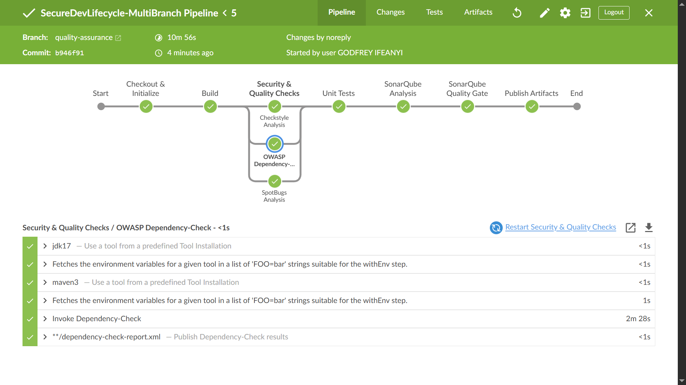

#### 🛡️ OWASP Dependency-Check

**[OWASP Dependency-Check](https://owasp.org/www-project-dependency-check/)** is a software composition analysis (SCA) tool that identifies publicly disclosed vulnerabilities in project dependencies. It leverages the National Vulnerability Database (NVD) and other sources to scan dependencies, particularly `.jar`, `.war`, and `.ear` files in Java applications.

In the context of this project, it plays a **critical role** in ensuring compliance and application security by detecting vulnerabilities in third-party libraries—often a common attack vector. By integrating it early in the CI pipeline, developers are alerted about insecure dependencies before the application is deployed.

---

##### 🔍 Jenkins Pipeline Stage: `OWASP Dependency-Check`

```groovy
stage('OWASP Dependency-Check') {
    steps {
        dependencyCheck additionalArguments: '''
            --scan **/target/dependency/**/*.jar 
            --format XML 
            --project "TrainBooking-App"
            --out target/OWASP-dependency-check
            ''', 
        odcInstallation: 'OWASP-Dependency-Check'
        dependencyCheckPublisher pattern: '**/dependency-check-report.xml'
    }
}
```

##### 📌 What This Stage Does:

* **Scans dependencies** in the build directory (`target/dependency/**/*.jar`) for known vulnerabilities.
* **Generates XML-formatted reports** to `target/OWASP-dependency-check/` for later consumption.
* **Publishes results** to the Jenkins build UI so users can review found vulnerabilities and decide on mitigation.
* **Links the report** into the Jenkins UI through the `dependencyCheckPublisher` step for easy access by developers and auditors.

##### 📈 Why It Matters:

* Embeds security into the development lifecycle (shift-left security).
* Helps meet regulatory compliance and security standards (e.g., ISO 27001, SOC2).
* Prevents deploying software with known CVEs (Common Vulnerabilities and Exposures).

This ensures that security and compliance are not afterthoughts—they're integrated into the very heart of CI/CD workflows.

##### 🛡️ OWASP Dependency-Check Results

###### 🛡️ OWASP Dependency-Check Trend
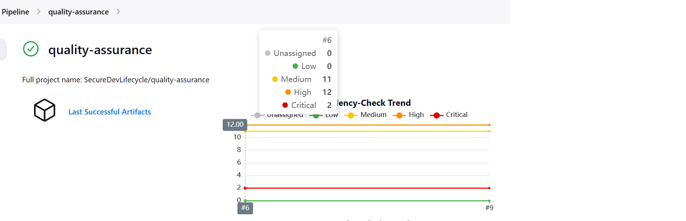

###### Dependency-Check Results
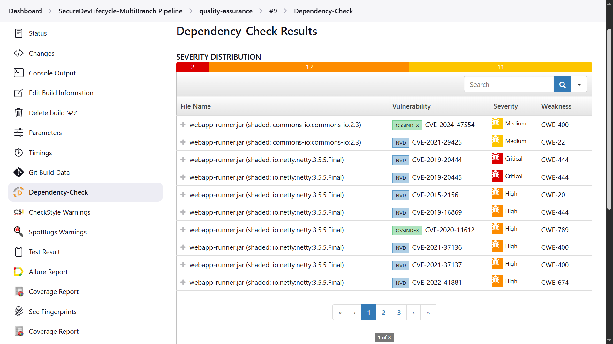
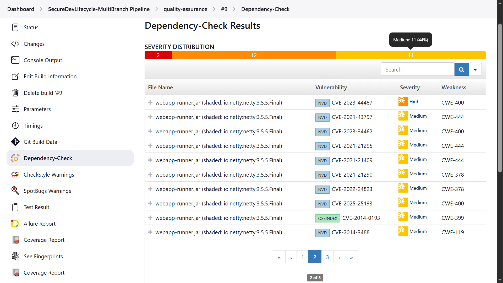
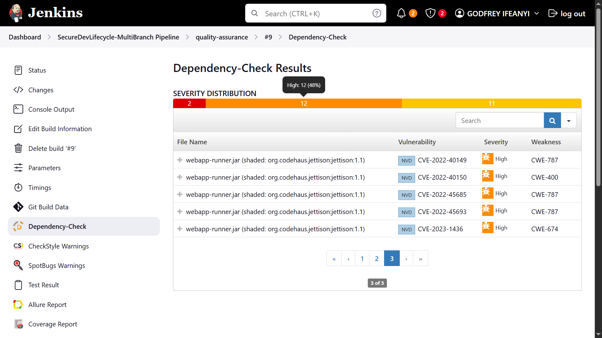


---

#### 🐞 SpotBugs Analysis

**[SpotBugs](https://spotbugs.github.io/)** is a static code analysis tool that detects potential bugs in Java bytecode. It examines compiled `.class` files for common programming errors such as null pointer dereferences, infinite recursive loops, dead stores, and other patterns that may lead to runtime failures or subtle bugs.

In this project, SpotBugs serves as a proactive quality gate to catch defects **before** they make it to production. It helps enforce good coding practices, improves reliability, and aligns with security and compliance goals.

---

##### 🔍 Jenkins Pipeline Stage: `SpotBugs Analysis`

```groovy
stage('SpotBugs Analysis') {
    steps {
        sh 'mvn spotbugs:spotbugs'
    }
    post {
        success {
            recordIssues tools: [spotBugs(pattern: '**/spotbugsXml.xml')]
            archiveArtifacts artifacts: '**/spotbugsXml.xml'
        }
        failure {
            echo 'SpotBugs failed - build will fail as expected.'
            error('SpotBugs analysis failed.')
        }
    }
}
```

##### 📌 What This Stage Does:

* Runs the Maven SpotBugs plugin to scan the compiled codebase.
* Generates a SpotBugs report in XML format (`spotbugsXml.xml`).
* Publishes the results using the Jenkins **Warnings Next Generation** plugin (`recordIssues`).
* Archives the report as a build artifact for future inspection.
* Marks the build as failed if SpotBugs detects critical issues.

##### ✅ Why SpotBugs Is Important:

* Detects hidden defects at an early stage.
* Improves code maintainability and readability.
* Acts as a preventive measure against runtime bugs.
* Encourages developers to write cleaner and safer Java code.

Including SpotBugs as a parallel stage alongside other QA checks reinforces a culture of **proactive quality assurance** in this secure and compliant pipeline.

##### 🐞 SpotBugs Warnings Result
###### 🐞 SpotBugs Warnings Trend
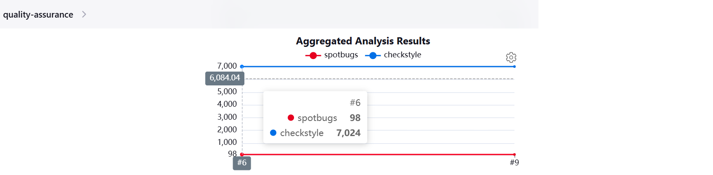
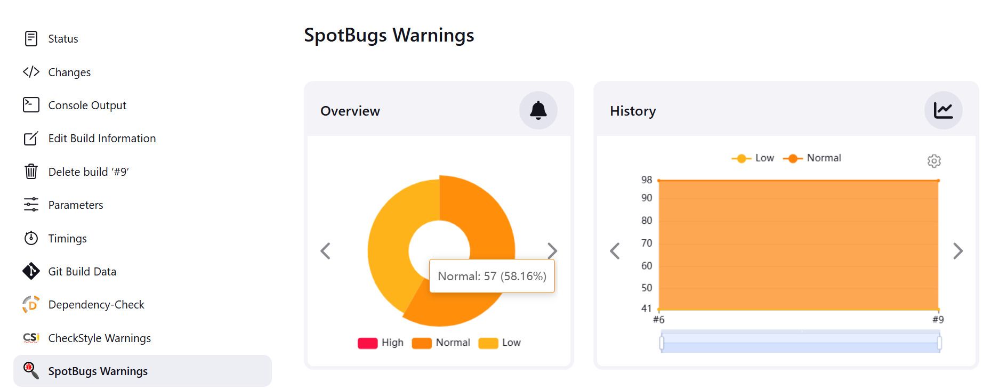

###### 🐞 SpotBugs Warnings 
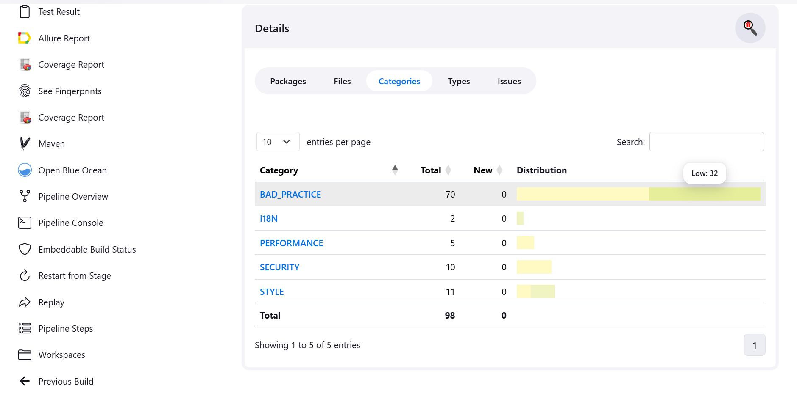
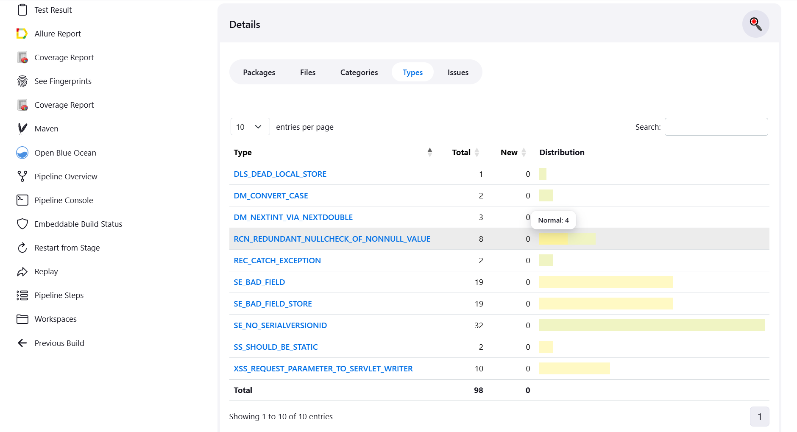
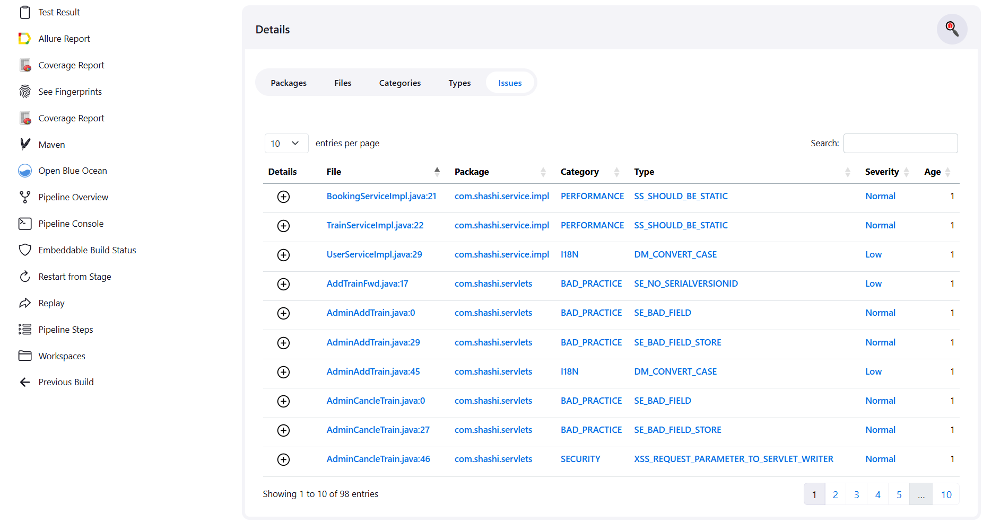

---

#### 📏 Checkstyle Analysis

**[Checkstyle](https://checkstyle.sourceforge.io/)** is a development tool that helps programmers write Java code that adheres to a defined set of coding standards. It performs static analysis of the source code to ensure that the style guidelines—such as indentation, naming conventions, line length, and Javadoc presence—are consistently followed across the codebase.

In this project, **Checkstyle** plays a key role in maintaining **code consistency**, **readability**, and **team-wide compliance** with established best practices. Enforcing these standards ensures that the codebase remains clean and maintainable over time, which is critical in secure and regulated environments.

---

##### 📋 Jenkins Pipeline Stage: `Checkstyle Analysis`
```groovy
stage('Checkstyle Analysis') { 
    steps {
        sh 'mvn checkstyle:checkstyle'
    }
    post {
        success {
            recordIssues tools: [checkStyle(pattern: '**/checkstyle-result.xml')]
            archiveArtifacts artifacts: '**/checkstyle-result.xml'
        }
        failure {
            echo 'Checkstyle failed - build will fail as expected.'
            error('Checkstyle analysis failed.')
        }
    }
}
```

##### 📌 What This Stage Does:
- Executes the Maven Checkstyle plugin to scan the Java source code.
- Generates a detailed XML report (`checkstyle-result.xml`) containing all style violations.
- Uses Jenkins’ **Warnings Next Generation** plugin to visualize the issues.
- Archives the Checkstyle report for inspection and auditing purposes.
- Fails the pipeline when serious formatting violations are detected.

##### ✅ Why Checkstyle Is Important:
- Encourages clean, consistent code formatting across teams.
- Prevents the accumulation of messy or unstructured code.
- Simplifies code reviews by enforcing uniform standards.
- Enhances long-term maintainability of the codebase.
- Contributes to overall software quality and developer accountability.

Integrating Checkstyle into the pipeline ensures that every commit adheres to the team’s coding standards—supporting not just quality, but also **compliance and collaboration**.

##### 📏 Checkstyle Analysis Result Images

###### 📏 Checkstyle Analysis Trend
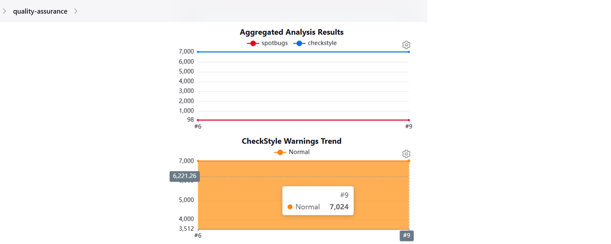
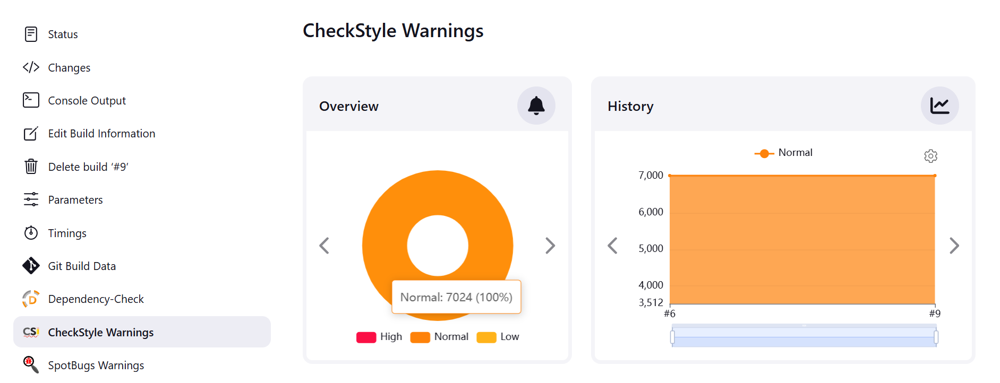

###### 📏 Checkstyle Analysis Result
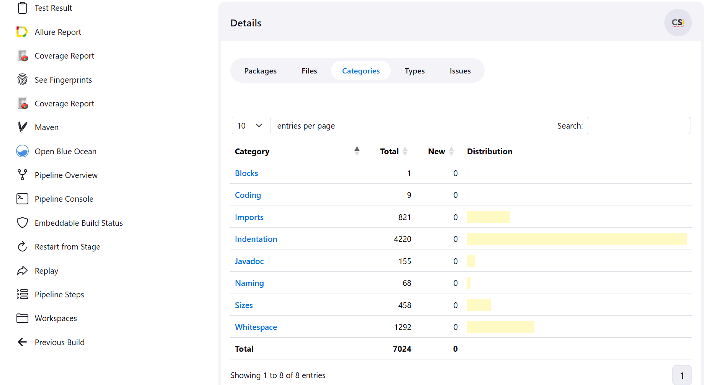
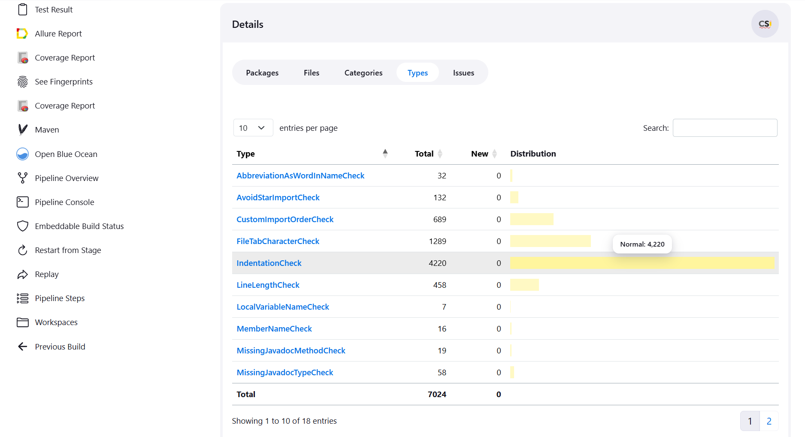
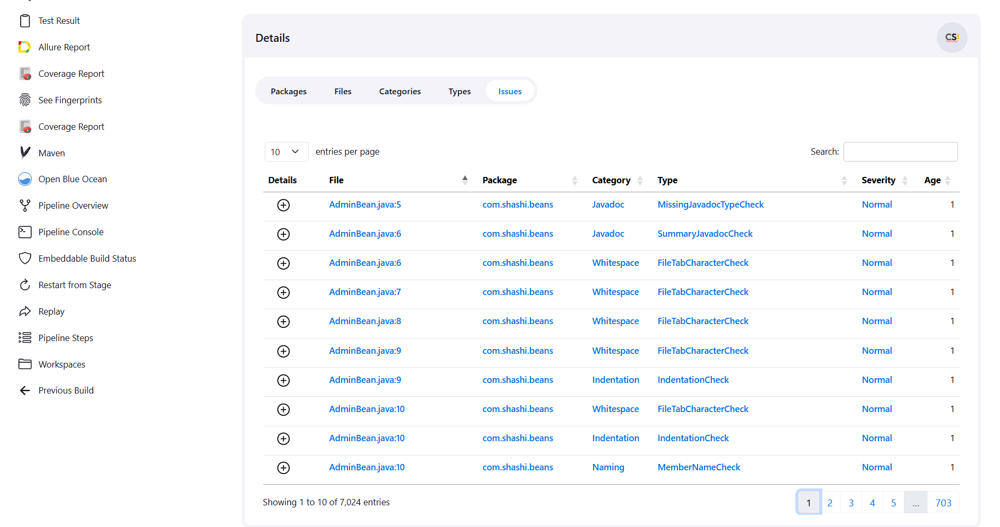

---


### 🧪 Unit Tests

**Unit testing** is a fundamental practice in software development where individual components or functions are tested in isolation to ensure they work as expected. Unit tests help catch bugs early, provide documentation for intended behavior, and give developers confidence when making changes or adding new features.

In this project, the **Unit Tests** stage is critical for verifying the correctness of business logic and ensuring that changes don’t introduce regressions. Beyond executing tests, this stage also collects **test reports**, **code coverage data**, and **rich visual results** via Allure.

---

#### 🧩 Jenkins Pipeline Stage: `Unit Tests`
```groovy
stage('Unit Tests') {
    steps {
        sh 'mvn jacoco:report -Ddependency-check.skip=true'
    }
    post {
        always {
            // Publish JUnit test results
            junit 'target/surefire-reports/*.xml'

            // Publish Allure report
            allure([ 
                includeProperties: false,
                jdk: '', 
                results: [[path: 'target/allure-results']],
                reportBuildPolicy: 'ALWAYS'
            ])

            // Publish JaCoCo coverage report
            jacoco(
              execPattern: '**/jacoco.exec',
              classPattern: '**/classes',
              sourcePattern: 'src/main/java',
              exclusionPattern: '**/test/**/*.class',
              skipCopyOfSrcFiles: false,
              changeBuildStatus: true
            )
        }
    }
}
```

---

#### ✅ What This Stage Covers:
- 🧪 **Executes Unit Tests** using Maven Surefire.
- 🧾 **JUnit Reports** are published for tracking pass/fail stats.
- 📊 **Code Coverage** is analyzed via **JaCoCo**:
  - Ensures critical code paths are covered by tests.
  - Fails the build if thresholds aren’t met.
- 📈 **Allure Reports** generate a rich, visual representation of the test results.

---

#### 🚀 Why Unit Testing Matters:
- Detects defects early in the development cycle.
- Prevents regressions when code evolves.
- Helps developers and reviewers understand component behavior.
- Enhances test-driven development (TDD) practices.
- Offers confidence that the codebase is stable, maintainable, and ready for production.

Including this stage in the CI pipeline strengthens your software’s **resilience**, **quality**, and **compliance posture** by ensuring every feature is properly verified before deployment.

---

#### 🖼️ Unit Testing Reports (Screenshots)

Below are visual representations of the testing and quality metrics generated during the **Unit Tests** stage:

##### ✅ JUnit Test Report
A summary showing test case results, including passed and failed unit tests.

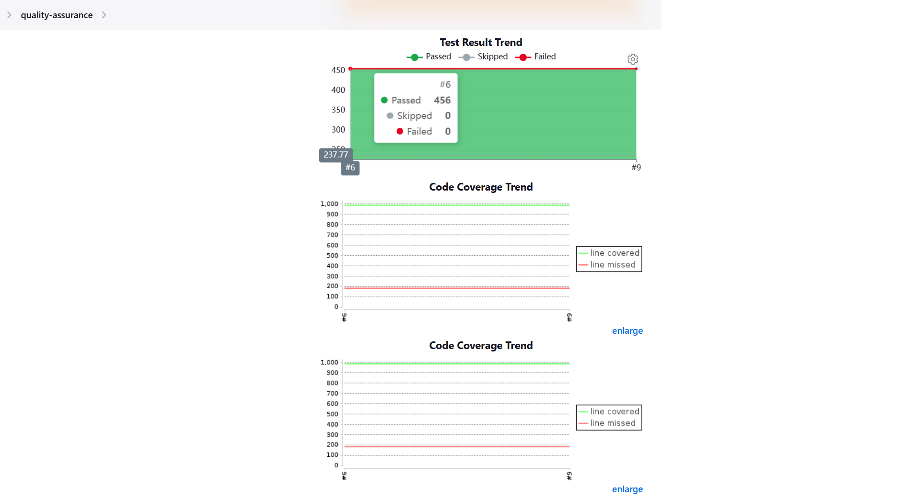
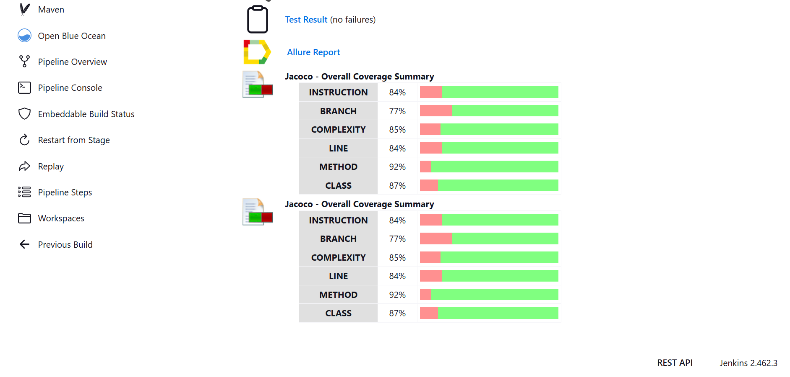
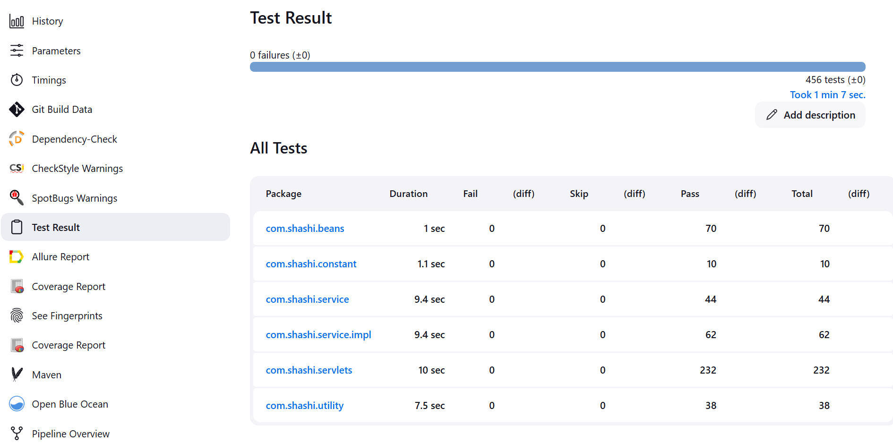


##### 📊 JaCoCo Code Coverage Report
Graphical and tabular breakdown of code coverage — lines, branches, and methods.

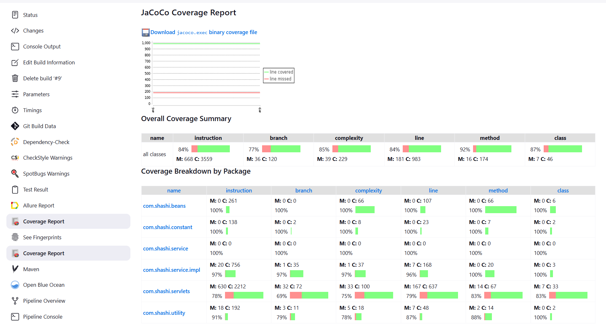
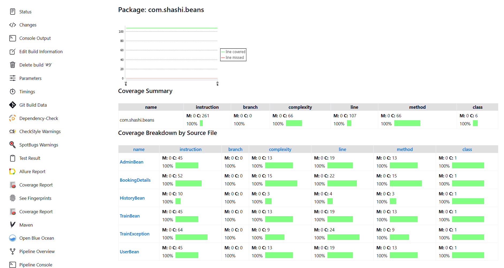
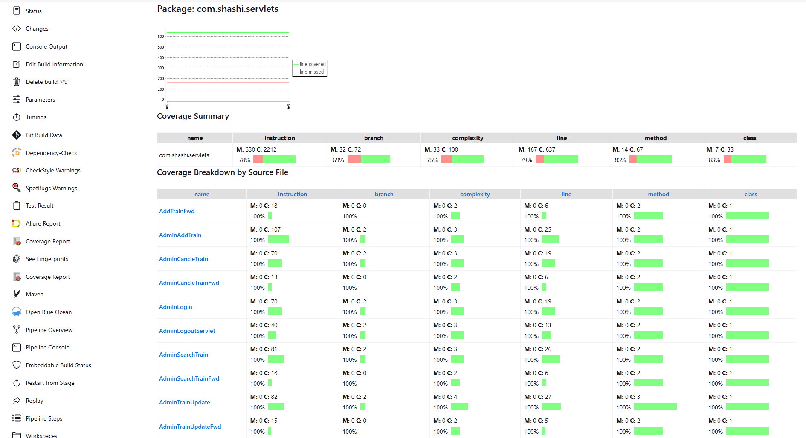


##### 📈 Allure Report Dashboard
Rich and interactive report showing detailed test flows, environment, and results.

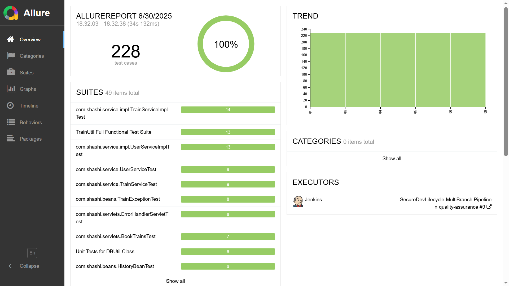
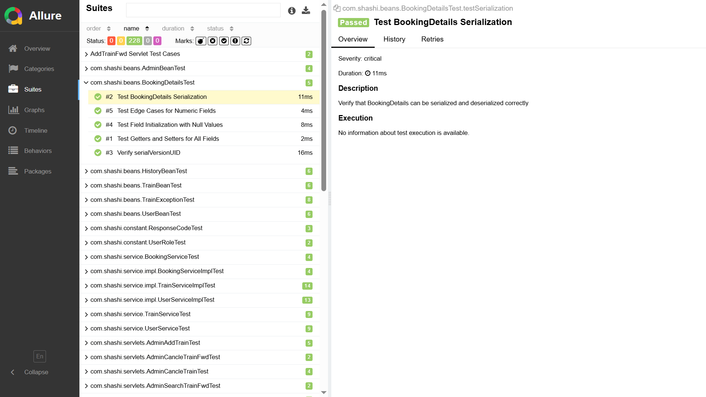

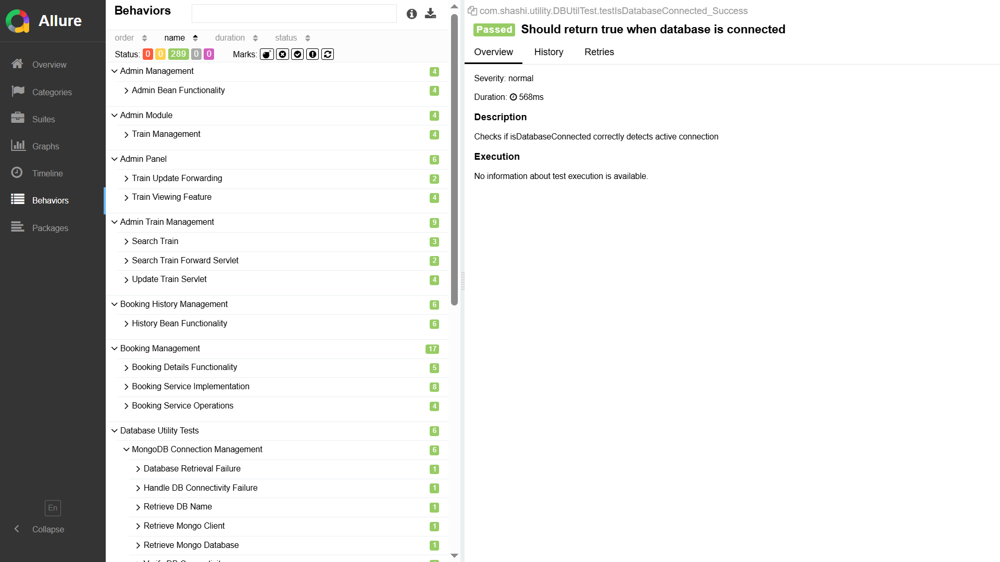
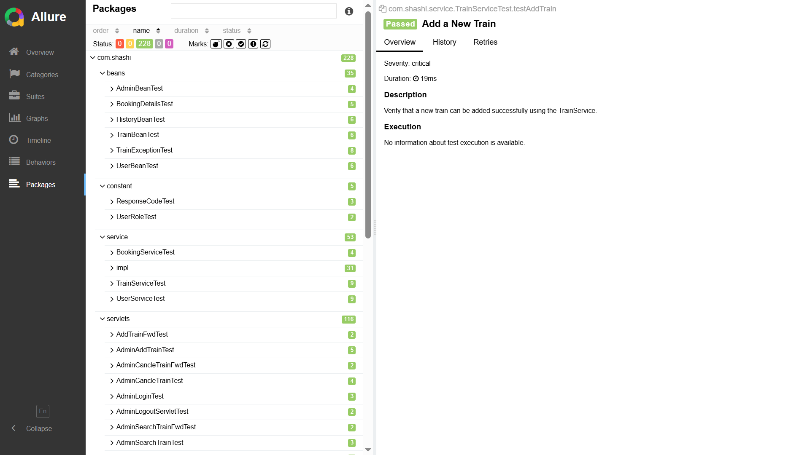


---


### 📊 Stage: SonarQube Analysis

**[SonarQube](https://docs.sonarsource.com/sonarqube-server/latest/)** is a comprehensive static code analysis tool that enables continuous inspection of code quality and security. It analyzes source code to identify bugs, vulnerabilities, code smells, duplications, and tracks code coverage from unit tests. By integrating SonarQube in a CI/CD pipeline, teams ensure that every commit meets a minimum standard of quality and compliance.

#### 🔍 Why SonarQube Is Critical in This Project

- **Detects bugs and vulnerabilities early** before deployment.
- **Measures technical debt** and enforces clean code practices.
- **Improves long-term maintainability** and scalability of the codebase.
- **Tracks code coverage** using integrated reports like JaCoCo.
- **Automates compliance enforcement** via Quality Gates.

---

#### 🧪 Jenkins Stage: SonarQube Analysis

```groovy
stage('SonarQube Analysis') {
    steps {
        catchError(buildResult: 'UNSTABLE', stageResult: 'FAILURE') {
            withSonarQubeEnv('sonar-server') {
                sh """
                    $SCANNER_HOME/bin/sonar-scanner \
                    -Dsonar.projectName=TrainBooking-App \
                    -Dsonar.projectKey=TrainBooking-App \
                    -Dsonar.java.binaries=target/classes \
                    -Dsonar.sources=src/main/java \
                    -Dsonar.tests=src/test/java \
                    -Dsonar.coverage.jacoco.xmlReportPaths=**/jacoco.xml
                """
            }
        }
    }
}
```

#### ⚙️ What This Stage Does

- Wraps analysis in `catchError` to **prevent complete pipeline failure** and mark the build as unstable if SonarQube is unreachable.
- Uses `withSonarQubeEnv` to **inject SonarQube configuration and credentials** into the shell environment.
- Executes the `sonar-scanner` command-line tool with flags that define:
  - **Project metadata**: name and key
  - **Directories** for compiled binaries and source/test files
  - **Coverage report path** for `jacoco.xml` integration

#### 📊 What It Produces

- A detailed **SonarQube dashboard** for the project with metrics on:
  - Bugs
  - Vulnerabilities
  - Code smells
  - Test coverage
  - Duplications and complexity
- Enforces **SonarQube Quality Gates** in the next stage to block poor-quality code from being released.

---

#### 📸 SonarQube Analysis & Quality Gate Screenshots

SonarQube provides deep insights into the overall health, maintainability, and security of the codebase. This section includes visual evidence of those insights from the pipeline.

##### 🔍 SonarQube Dashboard
A summary of code quality metrics including bugs, vulnerabilities, code smells, coverage, and duplication.

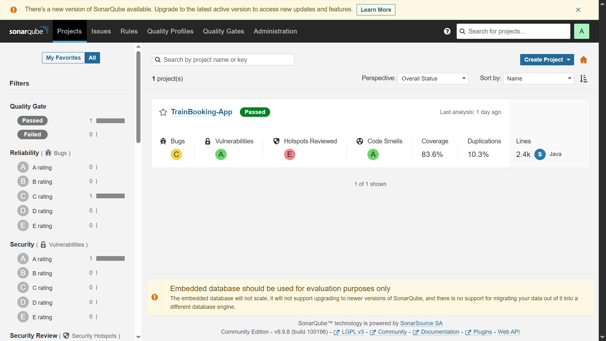
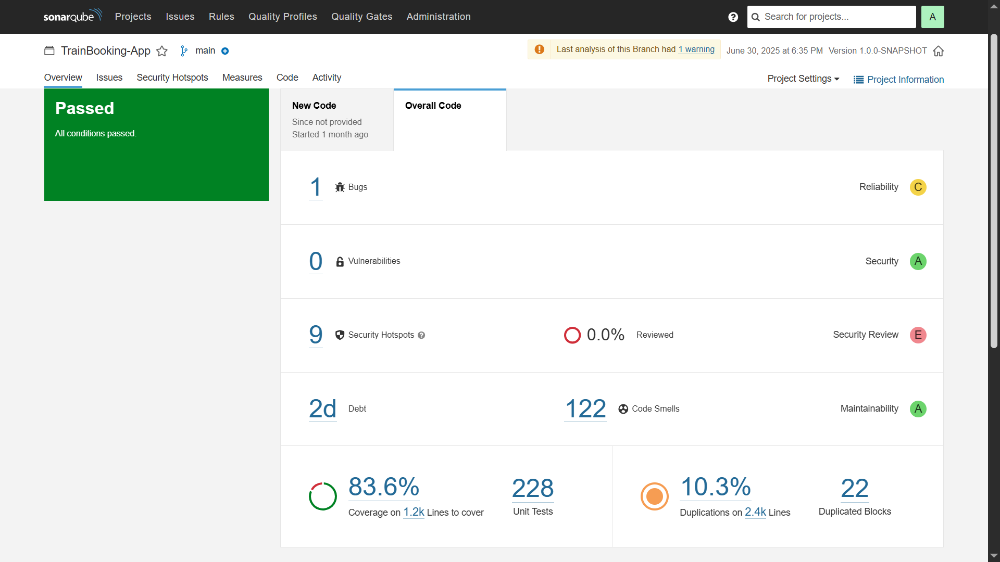
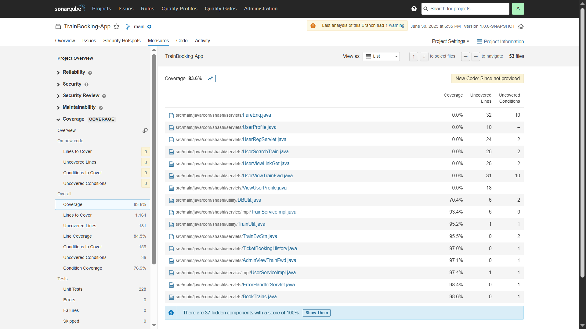
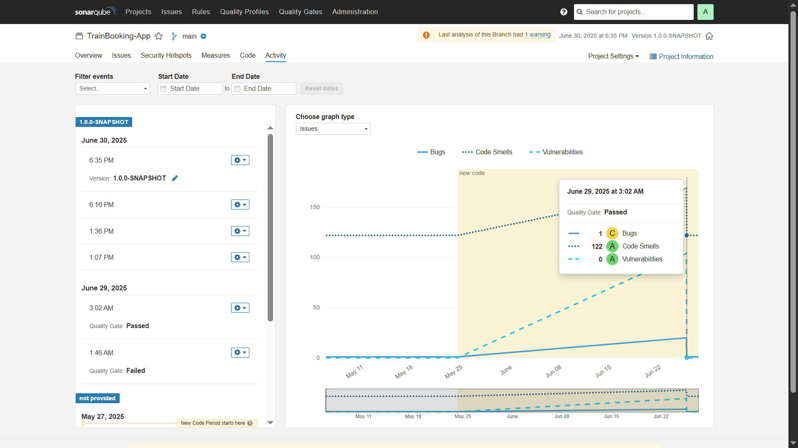


---


### 🚦 Stage: SonarQube Quality Gate

* Waits (max 2 minutes) for SonarQube quality gate result.
* Fails build if gate is not passed.

#### ✅ Quality Gate Status
The Quality Gate result shows if the build meets the predefined quality criteria (e.g., minimum test coverage, zero critical bugs).

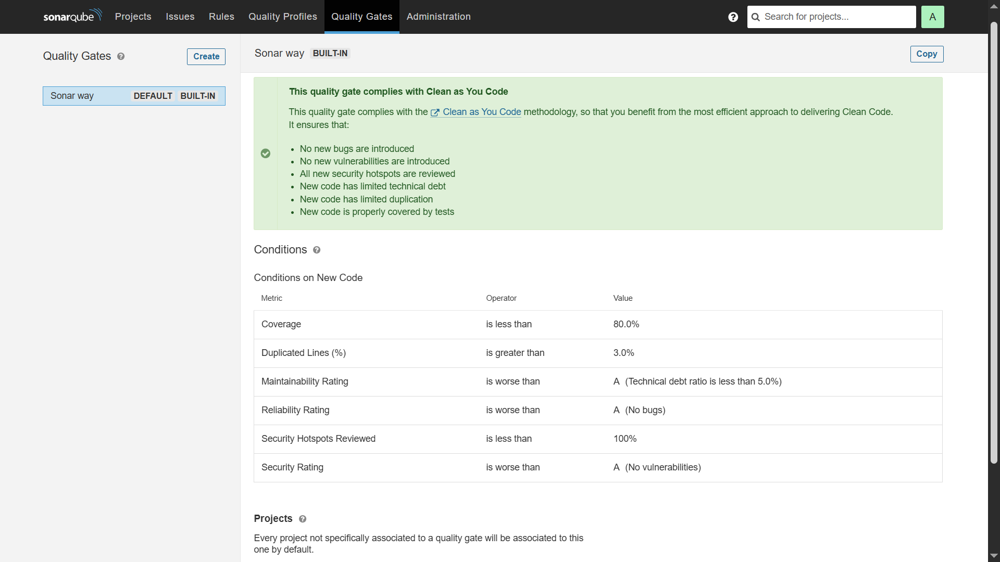


### 📤📦 Stage: Publish Artifacts

The `Publish Artifacts` stage is responsible for deploying the final built application and related deliverables (e.g., `.war` files, libraries) to a configured Maven repository in **[Nexus Repository](https://www.sonatype.com/products/sonatype-nexus-repository)**. This stage is essential for making build artifacts available to downstream processes, teams, or deployment environments.

#### 🔧 Purpose in This Project

In this project, once the application has passed through all stages of build, quality, and testing, the resulting artifacts are deployed using Maven's `deploy` goal to the **Nexus Repository**. This ensures that the packaged application (in our case, a WAR file) is accessible from the **Nexus Artifactory** a central artifact repository.

The use of:

```groovy
-DskipTests=true \
-Ddependency-check.skip=true \
-Dspotbugs.skip=true \
-Dcheckstyle.skip=true
```

ensures that these steps are skipped during deployment to avoid redundant checks already handled in earlier pipeline stages.

Jenkins uses the `withMaven` step to leverage global Maven configurations and ensure traceability of published artifacts. This helps maintain consistency across builds and promotes best practices in artifact versioning and reuse.

---

#### 📸 Artifact Publication Screenshots

Below are images capturing the published artifacts and Jenkins UI for artifact archiving.

##### 📤 Published Artifact Summary (Jenkins UI View)

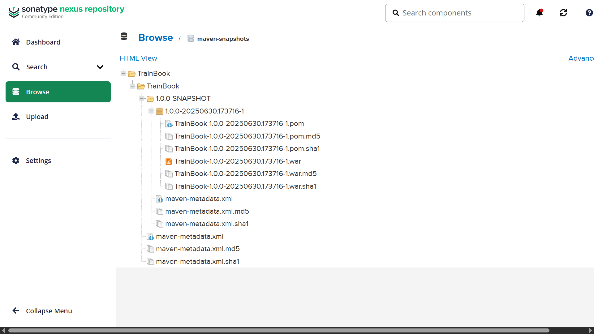

##### 📁 Artifact Download Links

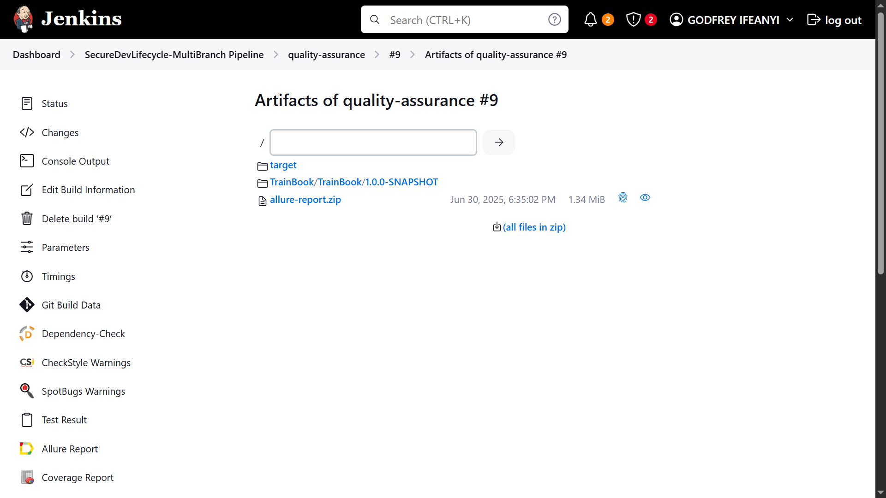


---


### 📩📬 Post Build Actions

The **Post Build Actions** section defines what happens after the Jenkins pipeline completes its execution—whether it ends in **success** or **failure**. This stage is crucial for ensuring visibility, traceability, and feedback to the development or DevOps teams.

#### ✅ On Success:

* **Artifact Archival**: All WAR files, analysis reports (XML, HTML), and other relevant output from the build are archived using `archiveArtifacts`. These files are made accessible via the Jenkins web interface for inspection or downstream usage.
* **Slack Notification**: A detailed Slack message is sent to the defined channel (via `SLACK_CHANNEL`), summarizing:

  * Job name and build number
  * Build duration
  * Build URL
  * Links to archived reports including:

    * SpotBugs
    * OWASP Dependency Check
    * Checkstyle
    * JaCoCo Coverage Report

#### ❌ On Failure:

* A Slack alert is sent notifying the team of the build failure with job metadata and the failure status.

This stage plays a critical role in establishing observability, team awareness, and rapid feedback during the CI process.

---

#### 📷 Images: Post Build Actions and Slack Notifications


1. ✅ **Successful Jenkins build artifacts view**

   * Location: Jenkins > Job > Build # > *Artifacts*

   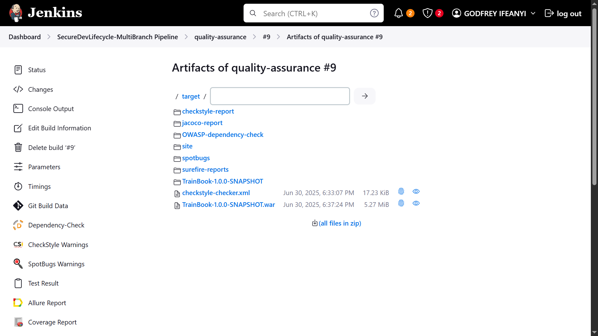


2. 📤 **Slack message for successful build**

   * Capturing direct report links and duration

   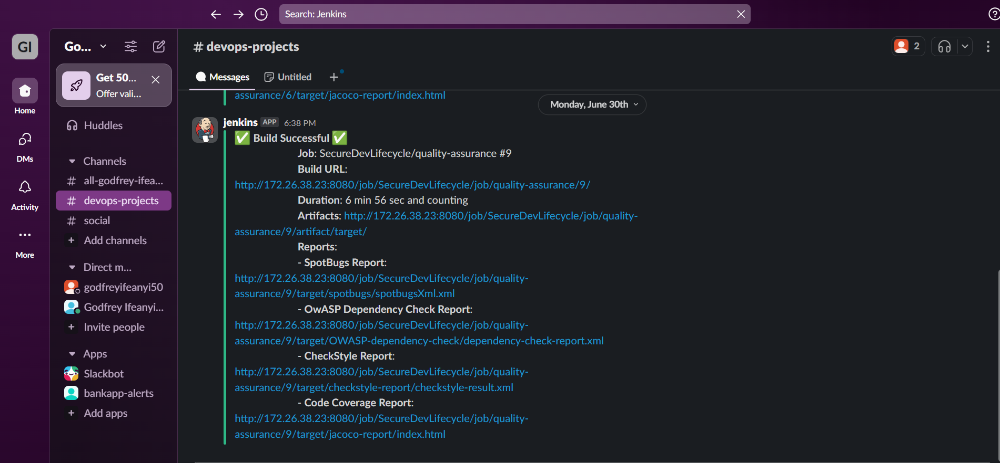

3. ❌ **Slack message for failed build**

   * Displaying failure summary and job metadata

   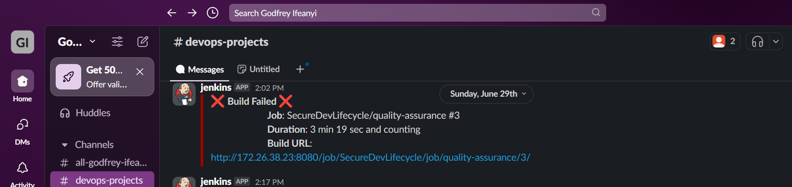


---


## ⚙️ Prerequisites & Project Setup

These are the foundational tools and configurations required for the project:

### 🖥️ Server Setup

#### 💻 Jenkins Setup

* Jenkins server up and running (v2.x or later recommended)
* Properly configured Jenkins agent (can be the master or a dedicated node)

#### 📦 Nexus and SonarQube Server Setup

* Nexus server up and running 
* SonarQube Server up and running

---

### 🔐 Credentials & Integrations

These are required for secure repository access and external integrations:

#### 🔑 Jenkins Credentials

* A Git credential (ID: `git-cred`) with access to your GitHub repository.

#### 🔐 SonarQube Configuration

* A SonarQube server connection configured in Jenkins under:
  `Manage Jenkins → Configure System → SonarQube servers`
* Project Key: `TrainBooking-App`

#### 🔔 Slack Notification Setup

* Slack Webhook integration configured in Jenkins with the credentials configured `slack-cred`
* A valid channel name (`#devops-projects`) and permission to send messages.

#### 🧩 Nexus Config File Management via Config File Provider

* Config File Provider Plugin to inject custom Maven `settings.xml` for Nexus integration.
* `maven-settings` ID is referenced to securely connect to Nexus using credentials defined in Jenkins.
* Ensures artifact deployment and dependency resolution aligns with enterprise repository policies.

---

### 🧰 Required Jenkins Plugins

- **Blue Ocean**
- **Pipeline: Stage View Plugin**
- **OWASP Dependency-Check plugin**
- **Warnings-Next Generation Plugin**
- **jacoco Plugin**
- **JUnit Plugin**
- **Allure Jenkins Plugin**
- **Slack Notification Plugin**
- **Eclipse Temurin installer:** enables installation of different versions of JDK
- **SonarQube Scanner for Jenkins**
- **Config File Provider Plugin:** allows Jenkins to inject Nexus-related configuration files (like `settings.xml`) into build jobs for seamless artifact management.
- **Maven Integration**
- **Pipeline Maven Integration**


### ⚙️ Global Tools Configuration

Ensure these tools are configured under **Manage Jenkins → Global Tool Configuration**:

* JDK 17 (label: `jdk17`) > `JDK installations`
* Maven 3 (label: `maven3`) > `Maven installations`
* Sonar Scanner (label: `sonar-scanner`) > `SonarQube Scanner installations`
* Dependency-Check (`OWASP-Dependency-Check`) > `Dependency-Check installations`
* Allure Report (`Allure Commandline`) > `Allure Commandline installations`

---

### 🏠 Infrastructure Setup

For a detailed guildlines on how to setup the entire pipeline and infrastructure, kindly visit the **[Infrastructure Setup Directory](./Infrastructure-Setup)**.

---

## 🔪 Usage Instructions

### ▶️ Trigger a Build

* Navigate to the Jenkins job
* Enter a Git branch name or use the default
* Click **Build Now**

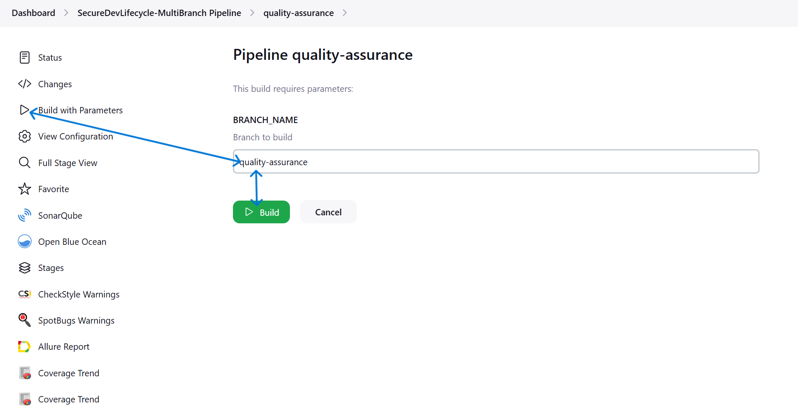

### 📁 View Reports

* JUnit: `target/surefire-reports/`
* Allure: `target/allure-results/`
* OWASP: `target/OWASP-dependency-check/`
* SpotBugs: `target/spotbugsXml.xml`
* Checkstyle: `target/checkstyle-result.xml`
* JaCoCo: `target/jacoco-report/index.html`

---

## 🧱 Project Structure

```
SecureDevLifecycle/
├── src/
│   ├── main/java/        # Application source code
│   └── test/java/        # Unit test code
├── pom.xml 
├── target/               # Build output, reports, artifacts
├── Jenkinsfile           # Pipeline as Code definition
├── Infrastructure-Setup
├── images
```

---

## 👤 Contributing & Feedback

We welcome contributions and feedback. Feel free to:

* Open issues
* Submit pull requests
* Share suggestions or enhancements

---

## 🔹 Badges (To Be Added)

* Build Status: 
* Test Coverage: 
* SonarQube Quality Gate: 

---

## 📄 License

This project is licensed under the **MIT License**. See the [LICENSE](LICENSE) file for details.

---

## 👨‍💻 Author & Contact

**Godfrey Ifeanyi**
GitHub: [@Godfrey22152](https://github.com/Godfrey22152)
LinkedIn: [linkedin.com/in/godfrey-ifeanyi](https://www.linkedin.com/in/godfrey-ifeanyi)
Twitter: [@ifeanyi\_godfrey](https://x.com/@ifeanyi_godfrey)
